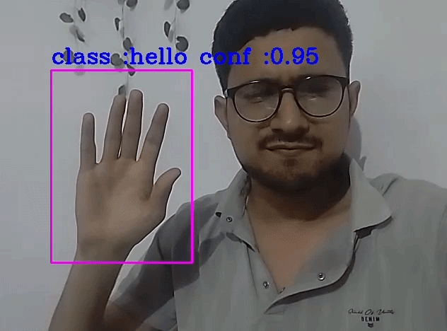
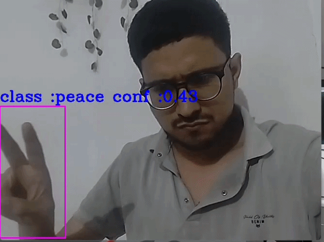
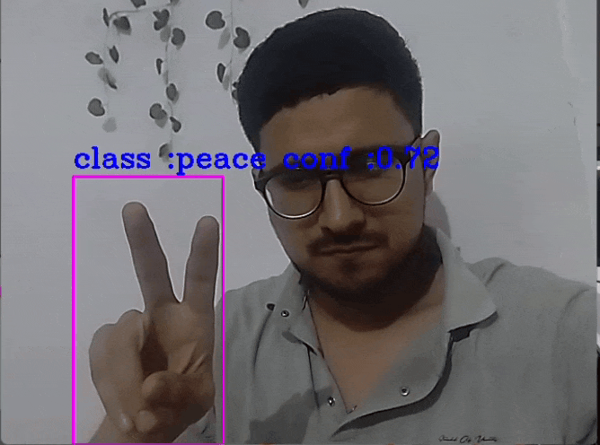
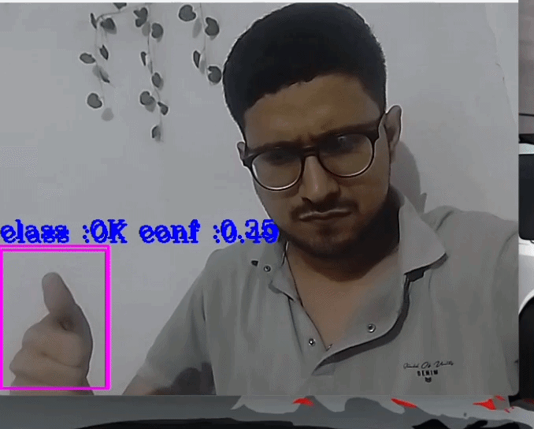
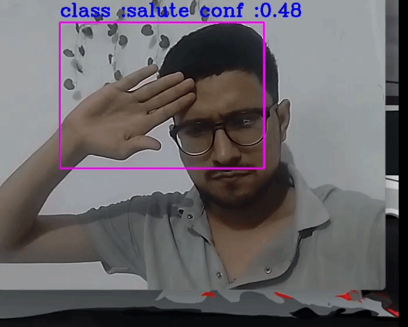
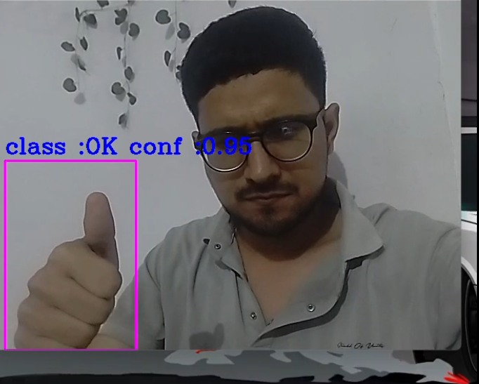
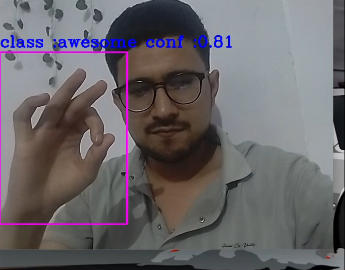
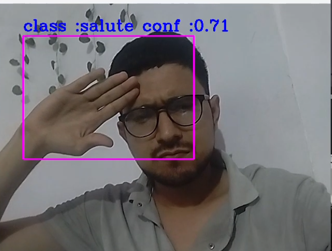

# Real-_time_hand_signs_detection
A high-performance, real-time computer vision pipeline for hand sign and gesture recognition. Features a modular, production-grade architecture built with PyTorch and OpenCV, optimized for low-latency live webcam inference, clean preprocessing, and seamless reproducibility.


---

# Demo GIFs

### Demo 1


### Demo 2


### Demo 3


### Demo 4


### Demo 5


---

# Screenshots

### Screenshot 1


### Screenshot 2


### Screenshot 3


---

# Features

- Real-time webcam detection
- YOLO-based hand sign recognition
- Live confidence score display
- Bounding box visualization
- Fast inference
- Custom trained model

---

# Project Structure

```text
real-time-hand-sign-detection/
│
├── main.py
├── best.pt
├── requirements.txt
├── README.md
├── gifs/
└── screenshots/
